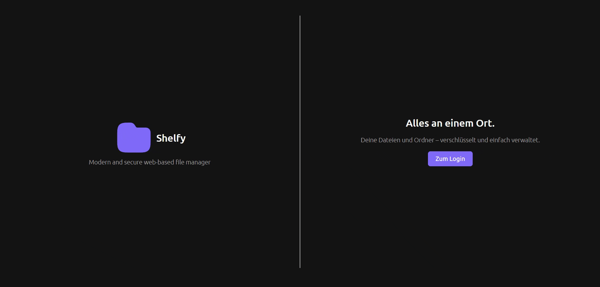
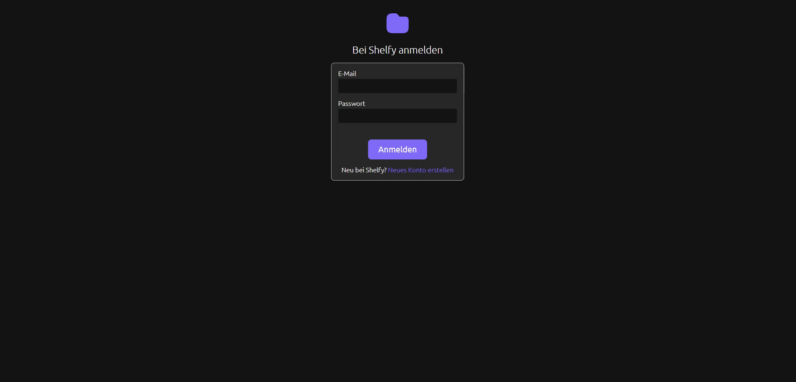

# Shelfy File Manager

Secure and modern file manager written in PHP and Angular based on custom MVC implementation as a REST-API made for the Web Engineering lectures at DHBW.

## Key features

The project was built with user-friendly features but also to maintain security.

### User authentication

User authentication is based on a custom JWT implemented session management.

### Storage management

In your storage you are able to manage:
- Folders: Create, delete and navigate
- Files: Upload, download, delete and view SHA-256-Hash

but also search for your private files and folders.

### Profile settings

To keep Shelfy the way you want, in your profile settings you are able to customize:
- Search behavior
- File overwrite mode
- Display options

## Security

To keep all your data secure. Shelfy uses it's custom JWT-based authentication.
On top of that all your data is securely encrypted using the encryption standard AES-256-GCM with per-user generated private keys.
This makes sure that only you can encrypt and decrypt your own data.

## Configuration

The application uses a customizable [configuration](Backend/src/Core/Configuration/Configuration.php).

The configuration can also be changed via the global [config.json](Backend/config/config.json) file.

## Open-source frontend resources
- https://www.svgrepo.com/svg/507300/folder
- https://icons.getbootstrap.com/
- https://coolors.co/211a1d-6320ee-8075ff-f8f0fb-cad5ca
- https://fonts.google.com/selection?query=ubuntu